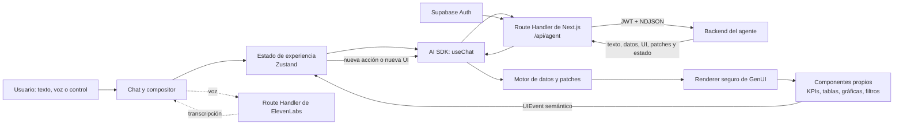
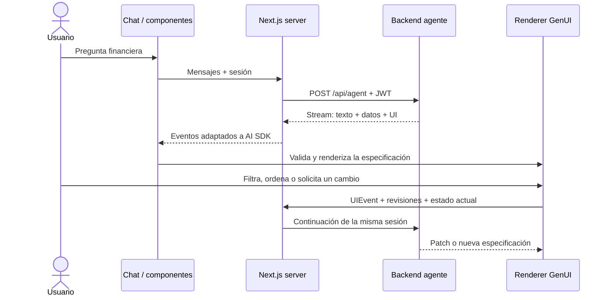
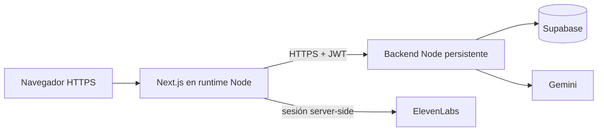

# Banorte GenUI — Frontend

Frontend de la demostración de **banca personal con interfaz generativa**. El usuario expresa una necesidad financiera en lenguaje natural y el sistema construye una vista útil con componentes propios —métricas, tablas, gráficas, filtros y controles— que después puede modificar mediante conversación o interacción directa.

Este repositorio no contiene pantallas prearmadas para cada pregunta. Renderiza una especificación declarativa y segura producida por el agente; las rutas `/dev/*` son únicamente harnesses de validación y no forman parte de la experiencia productiva.

## Qué demuestra

- El LLM interpreta la intención; no funciona sólo como chatbot.
- La UI se genera con una DSL tipada equivalente a la capa A2UI requerida por el reto.
- La interfaz puede cambiar por instrucciones como “deja sólo la tabla” o por eventos de sus controles.
- Cada evento conserva `sessionId`, revisión de UI y revisión de datos para mantener continuidad.
- El navegador nunca recibe las claves de Gemini ni ElevenLabs.
- El alcance de la demo está concentrado en banca personal: cuentas, saldos, movimientos, flujo de efectivo, comparaciones y patrones de gasto.

## Arquitectura del frontend



### Flujo de una consulta y una edición



## Tecnologías

| Capa | Implementación |
|---|---|
| Aplicación | Next.js 16, React 19 y TypeScript |
| Conversación/stream | Vercel AI SDK (`ai`, `@ai-sdk/react`) |
| Estado | Zustand |
| Contratos | Zod y paquete compartido `@banorte/contracts` |
| Visualización | ECharts, tablas y componentes propios |
| Movimiento | Motion |
| Autenticación | Supabase Auth desde rutas server-side |
| Voz | ElevenLabs con creación server-side de sesión efímera |

## Requisitos

- Git.
- Node.js **22 LTS** recomendado (el mínimo técnico del frontend es 20.9, pero el backend exige 22).
- Corepack habilitado.
- Backend `BanorteBackend` configurado y conectado al mismo proyecto de Supabase.

## Instalación desde cero

```bash
git clone git@github.com:Hydra115-code/banorte-gen-ui.git
cd banorte-gen-ui
corepack enable
corepack prepare pnpm@11.25.0 --activate
pnpm install --frozen-lockfile
cp .env.example .env.local
```

Configura `.env.local`:

```dotenv
AI_PROVIDER=google
AGENT_API_URL=http://127.0.0.1:3101/api/agent
AGENT_API_TOKEN=
SUPABASE_URL=https://TU_PROYECTO.supabase.co
SUPABASE_PUBLISHABLE_KEY=TU_CLAVE_PUBLICA
BANORTE_DEMO_LOGIN_ENABLED=false
BANORTE_DEMO_EMAIL=
BANORTE_DEMO_PASSWORD=
```

| Variable | Obligatoria | Uso |
|---|---:|---|
| `AGENT_API_URL` | Sí | Endpoint completo `/api/agent` del backend. En producción debe usar HTTPS. |
| `SUPABASE_URL` | Sí | Proyecto de Supabase compartido con el backend. |
| `SUPABASE_PUBLISHABLE_KEY` | Sí | Clave pública/anon de Supabase; no usar `service_role`. |
| `AI_PROVIDER` | No | Identificador de proveedor; actualmente `google`. |
| `AGENT_API_TOKEN` | No | Compatibilidad con backends legados; no sustituye el JWT de usuario. |
| `BANORTE_DEMO_LOGIN_ENABLED` | No | Muestra “Entrar a demostración” cuando también existen email y contraseña. |
| `BANORTE_DEMO_EMAIL` | Condicional | Cuenta sintética de demo; sólo variable server-side. |
| `BANORTE_DEMO_PASSWORD` | Condicional | Secreto de demo; nunca usar prefijo `NEXT_PUBLIC_`. |

No copies el `.env` de otra máquina ni subas secretos. El usuario se autentica en Supabase y Next.js conserva access/refresh tokens en cookies `HttpOnly`, `SameSite=Strict` y `Secure` en producción.

## Ejecución local

1. Arranca primero el backend en `127.0.0.1:3101` siguiendo su README.
2. En este repositorio ejecuta:

```bash
pnpm dev
```

3. Abre [http://127.0.0.1:3000](http://127.0.0.1:3000).
4. Inicia sesión con un usuario de Supabase que tenga datos sintéticos o habilita el acceso demo.

Para que la comunicación funcione, el backend debe incluir exactamente `http://127.0.0.1:3000` y/o `http://localhost:3000` en `AGENT_API_ALLOWED_ORIGINS`.

## Build de producción

```bash
pnpm build
pnpm start
```

El despliegue necesita un runtime **Node.js** compatible con streaming y variables server-side; no debe exportarse como sitio completamente estático.

## ¿Es obligatorio subirlo a la nube?

**No.** El documento del reto deja el proveedor de infraestructura a libre elección. Exige una demo en vivo, un repositorio ejecutable, datos/APIs y documentación técnica; no impone Vercel, Supabase hosted ni otro proveedor concreto.

Para evaluación remota sí es recomendable desplegarlo:




## Validación

Comprobaciones mínimas antes de una demo:

```bash
pnpm typecheck
pnpm build
pnpm contracts:verify
pnpm protocol:verify
pnpm banking:verify
pnpm dynamic-ui:verify
pnpm interaction:verify
pnpm quality:verify
pnpm performance:verify
```

Pruebas de integración que requieren el backend activo:

```bash
pnpm integration:agent-text:verify
pnpm integration:agent-ui:verify
pnpm integration:streaming-ui:verify
pnpm integration:ui-interaction:verify
pnpm integration:patch-sync:verify
```

Los harnesses bajo `/dev/*` sólo se incluyen en desarrollo para inspeccionar contratos, streaming, recuperación e interacciones.

## Contratos y seguridad

- `packages/contracts` debe conservar el mismo fingerprint que el paquete del backend.
- La UI aceptada es una estructura declarativa validada; no se ejecuta HTML o JavaScript generado por el modelo.
- Los eventos incluyen correlación, sesión y revisiones para evitar aplicar cambios obsoletos.
- Los datos financieros pertenecen al usuario autenticado; el backend aplica RLS.
- Ante pérdida de stream, conflicto de revisión o UI inválida, el frontend recupera snapshot o muestra una degradación segura.
- Nunca expongas `GEMINI_API_KEY`, `ELEVENLABS_API_KEY`, `SUPABASE_ACCESS_TOKEN` o `service_role` al navegador.

## Correspondencia con los entregables del reto

| Entregable | Evidencia en este repositorio |
|---|---|
| Componentes generativos | `src/features/generative-ui` y `src/shared/design-system` |
| Capa A2UI o equivalente | Contratos `UISpecification`, data registry, patches y renderer seguro |
| Ciclo cerrado | `UIEvent` vuelve al agente y produce una acción, patch o nueva UI |
| UI funcional y adaptable | Texto/voz, controles, tablas, gráficas, filtros y estados responsivos |
| Instrucciones de ejecución | Instalación, entorno, desarrollo, build y pruebas en este README |
| Arquitectura/trade-offs | Diagramas y decisiones documentadas aquí; coordinación completa en ambos README |

## Decisiones y trade-offs

- **DSL segura frente a código libre:** limita composiciones arbitrarias, pero evita ejecutar código generado y mantiene accesibilidad/identidad visual.
- **Streaming frente a respuesta única:** muestra progreso y reduce la espera percibida, a cambio de revisiones, patches y recuperación más complejos.
- **BFF de Next frente a llamadas directas:** añade un salto de red, pero protege tokens y normaliza autenticación y stream.
- **Componentes propios frente a pantallas por intención:** requiere un catálogo sólido, pero permite variación real sin esconder plantillas fijas.
- **Banca personal enfocada:** sacrifica amplitud de giros para entregar una experiencia demostrable, coherente y pulida.

## Estructura relevante

```text
src/app/                         rutas, layout y endpoints server-side
src/features/agent/              sesión, transporte y adaptación del stream
src/features/auth/               login y sesión Supabase
src/features/generative-ui/      runtime, renderer, patches e interacciones
src/features/voice/              experiencia de transcripción
src/features/workspace/          chat y área de trabajo
src/shared/design-system/        componentes visuales propios
packages/contracts/              contrato compartido con el backend
scripts/                         validaciones de contrato, UX, seguridad y rendimiento
```

## Checklist de demo

1. Backend y frontend reportan estado saludable.
2. El usuario demo tiene exclusivamente datos sintéticos y RLS activa.
3. Una pregunta abierta produce una UI adecuada, no una pantalla fija.
4. Un filtro o edición conversacional modifica la vista existente.
5. La interacción directa de la UI vuelve al agente y conserva continuidad.
6. Ningún secreto aparece en DevTools, logs o repositorio.
